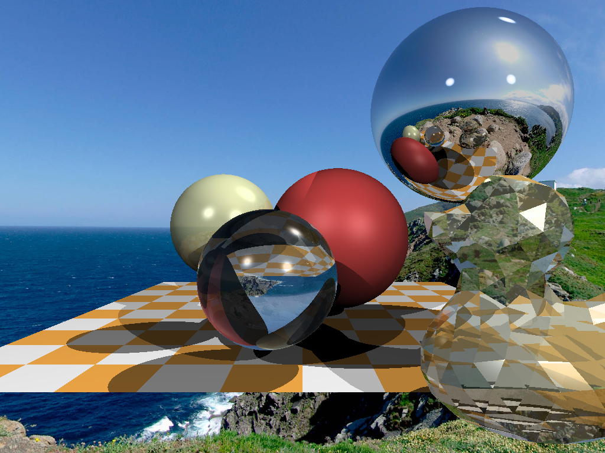

# TinyRayTracer
A Tiny Ray Tracer.

## Step by Step

Step 1: write an image to the disk

Step 2, the crucial one: ray tracing

Step 3: add more spheres

Step 4: lighting

Step 5: specular lighting

Step 6: shadows

Step 7: reflections

Step 8: refractions

Steo 9: beyond the spheres

Step 10: environment map

